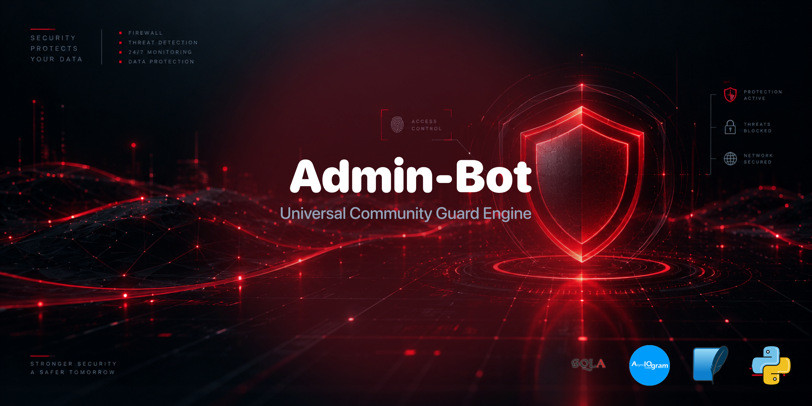

<p align="center">
  
</p>

<div align="center">

# 🛡️ Admin-Bot: Universal Community Guard Engine

</div>

A high-performance, asynchronous Telegram moderation bot engineered using **Aiogram 3.x** and **SQLAlchemy**. Designed as an all-in-one management tool for global Telegram groups, it automates user onboarding via customizable welcome questionnaires and enforces a strict, progressive automated punishment layer backed by an SQLite tracking database to keep chat rooms productive, clean, and spam-free.

<div align="center">

## 🎯 The Core Product Vision & Business Value

</div>

* **The Problem:** Online communities grow fast, inevitably attracting bad actors, advertisers, and disruptive link-spammers. Manual moderation wastes community managers' time, while noisy entrance logs and generic greetings clutter chat history, driving organic engagement down.
* **The Solution:** A unified, intelligent guard system. When a new member joins, they receive a targeted welcome questionnaire that cleans itself up automatically to prevent clutter. If any user breaks community guidelines by spamming links or profanity, the bot instantly sandboxes them with automated, progressive punishments.

<div align="center">

## 🛠️ Progressive Tiered Punishments & Features

</div>

* **Tier 1 Infraction (1/3 Warns):** The spam message is wiped instantly. The offender receives a public warning and is hit with a **2-minute Mute** (read-only) to cool down.
* **Tier 2 Infraction (2/3 Warns):** Upon a repeated offense, the message is wiped, and a **30-minute Mute** is automatically applied.
* **Tier 3 Threshold (3/3 Warns):** Reaching the final boundary triggers an absolute, permanent **Ban** from the group.
* **Automated Questionnaire Grid:** Greets new users with a clean introduction layout (name, rules agreement, background). To avoid flooding active chats, greeting elements delete themselves using localized timers.
* **Zero Logger Overhead:** Fully production-optimized code with removed background terminal logging noise for fast execution times and clean server environments.

<div align="center">

## 📂 Code Architecture

</div>

The codebase strictly follows clean, decoupled asynchronous patterns, isolating data mutations, route orchestration, and the moderation engine into modular packages:

```text
Admin-Bot/
├── .gitignore
├── LICENSE
├── README.md
├── banner.png
├── main.py
├── requirements.txt
└── app/
    ├── __init__.py
    ├── config.py
    ├── ui_text.py
    │
    ├── database/
    │   ├── __init__.py
    │   ├── db_manager.py
    │   └── models.py
    │
    └── handlers/
        ├── __init__.py
        ├── chat_events.py
        └── anti_spam.py
```

<div align="center">

## 🚀 Quick Local Deployment

</div>

1. Clone the repository:
   ```bash
   git clone https://github.com/Hades-db/Admin-Bot
   ```
2. Navigate to the project directory:
   ```bash
   cd Admin-Bot
   ```
3. Install dependencies:
   ```bash
   pip install -r requirements.txt
   ```
4. Create a `.env` file in the root folder and add your bot credentials:
   ```env
   TOKEN_TG_BOT=YOUR_TELEGRAM_BOT_TOKEN
   ```
5. Launch the engine:
   ```bash
   python main.py
   ```
